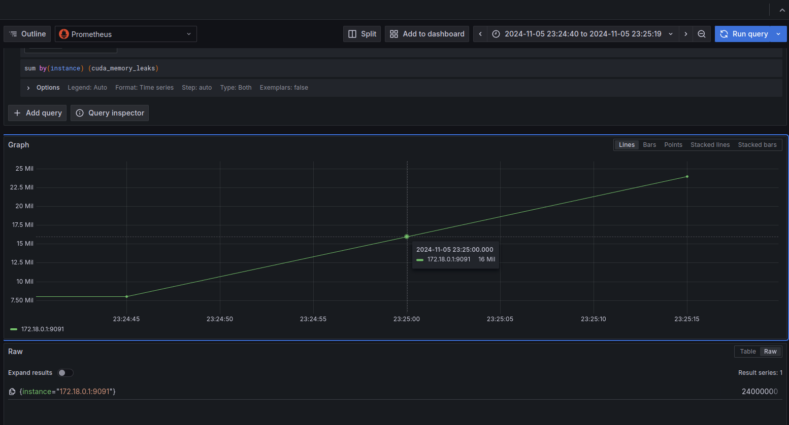

# GPUprobe

## IMPORTANT

GPUprobe has moved to an organization repository. This one is no longer
maintained.

[link to the new repo](https://github.com/GPUprobe/gpuprobe-daemon)

## Introduction

GPUprobe *(GPU probe, GP-uprobe)* provides utilities for observability
of GPU behavior via their interaction with the Cuda runtime API by leveraging 
eBPF uprobes.

The project is experimental, and still immature. However, some cool 
functionality is already available, which will be discussed below.

For information on building and running, refer to the 
[short guide](#building-and-running) on the subject.

## Usage

```
Usage: gpu_probe [OPTIONS]

Options:
      --memleak         Detects leaking calls to cudaMalloc from the CUDA runtime API
      --cudatrace       Maintains a histogram on frequencies of cuda kernel launches
      --bandwidth-util  Approximates bandwidth utilization of cudaMemcpy
  -h, --help            Print help
  -V, --version         Print version
```

## High-level Design

Metrics are exported in [OpenMetrics](https://github.com/prometheus/OpenMetrics/blob/main/specification/OpenMetrics.md) 
format via an http handler, which is intended to be scraped by Prometheus. This
allows for seamless integration with your favorite observability stack, e.g.
Grafana.



These metrics are also displayed periodically to stdout in their raw format.

```
# HELP total_cuda_mallocs Total number of cudaMalloc calls.
# TYPE total_cuda_mallocs gauge
total_cuda_mallocs 4
# HELP cuda_memory_leaks Cuda memory leak statistics.
# TYPE cuda_memory_leaks gauge
cuda_memory_leaks{addr="136071811694592"} 8000000
cuda_memory_leaks{addr="130222334672896"} 8000000
cuda_memory_leaks{addr="131679335219200"} 8000000
cuda_memory_leaks{addr="131251381993472"} 8000000
# HELP cuda_kernel_launches Cuda kernel launch statistics.
# TYPE cuda_kernel_launches gauge
cuda_kernel_launches{addr="109501748239152"} 1000
cuda_kernel_launches{addr="108636571265616"} 1000
cuda_kernel_launches{addr="110755787352656"} 1000
cuda_kernel_launches{addr="108636571265840"} 1000
cuda_kernel_launches{addr="95213067594320"} 1000
cuda_kernel_launches{addr="110755787352880"} 1000
cuda_kernel_launches{addr="95213067594544"} 1000
cuda_kernel_launches{addr="109501748238928"} 1000
# EOF
```

The various features are opt-in via command-line arguments passed to the 
program at launch. 

The metrics exported will still include those related to an disabled feature,
but will be empty. The difference is that the uprobes related to that feature
will not be attached, resulting in a lower-runtime overhead for relevant Cuda
runtime API calls and a lower memory footprint for the program.

**E.g.** running `gpuprobe --memleak` will only attach the uprobes needed for
the memleak feature, but the empty metrics for the cudatrace program will still
be exported by the OpenMetrics exporter.

## Memleak feature

This utility correlates a call to `cudaFree()` to the associated call to 
`cudaMalloc()`, allowing for a measurement of the number of leaked bytes 
related to a Cuda virtual address.

## CudaTrace feature

This utility keeps stats on the launched kernels and number of times that they
were launched as a pair `(func_addr, count)`. It can be thought of and
aggregated as a histogram of the frequencies of kernel launches.

## Bandwidth utilization feature

This feature approximates bandwidth utilization on the bus between host and 
device as a function of execution time and size of a `cudaMemcpy()` call.

This is computed naively with: `throughput = count / (end - start)`

Note that this only plausibly works for host-to-device *(H2D)* and
device-to-host *(D2H)* copies, as only these calls provide any guarantees of
synchronicity.

This feature is not yet exported. Below you will find a sample output of an 
older iteration that simply wrote the results to stdout.

```
GPUprobe bandwidth_util utility
========================


Traced 1 cudaMemcpy calls
        H2D 3045740550.87548 bytes/sec for 0.00263 secs
========================

Traced 2 cudaMemcpy calls
        H2D 2981869117.56429 bytes/sec for 0.00268 secs
        D2H 3039108386.38160 bytes/sec for 0.00263 secs
========================
```

## Building and Running

An eBPF compatible Linux kernel version is required for running GPUprobe, as
well as `bpftool`.

A `vmlinux.h` file is required for the build process, which can be created
by executing the following command from the project root:

```bash
bpftool btf dump file /sys/kernel/btf/vmlinux format c > src/bpf/vmlinux.h
```

Following that, you should be able to build the project.

```bash
cargo build
```

Root privileges are required to run the project due to its attaching of eBPF
uprobes.

```bash
sudo ./gpu_probe # --options
```
